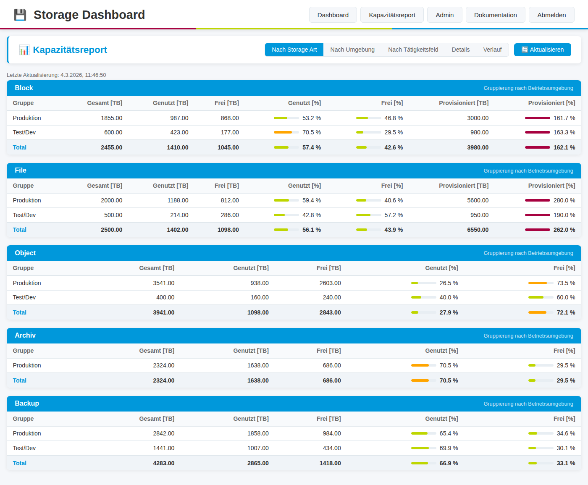
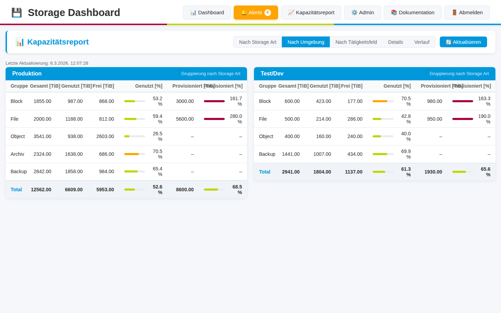
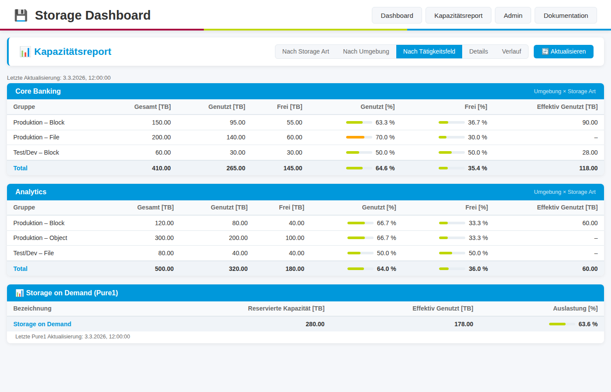
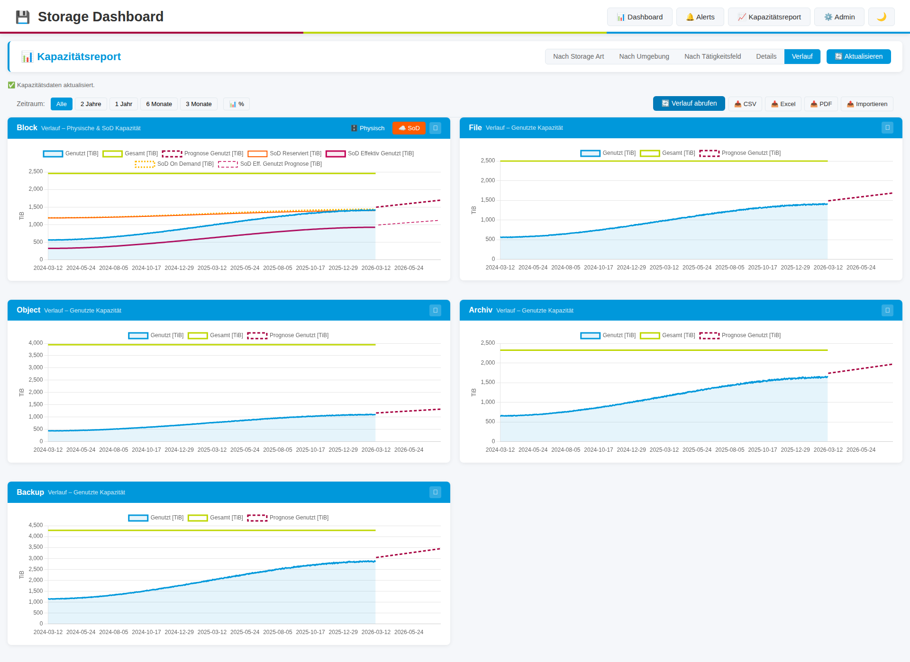

# Storage Dashboard

Ein Python-basiertes Dashboard zur Überwachung von Storage-Systemen verschiedener Hersteller über Browser und CLI.

## Screenshots

### Dashboard - Card View


### Dashboard - Details


### Admin-Bereich


### Kapazitätsreport – Nach Storage Art


### Kapazitätsreport – Nach Umgebung


### Kapazitätsreport – Nach Tätigkeitsfeld


### Kapazitätsreport – Details (alle Systeme)


### Kapazitätsreport – Verlauf mit Prognose


> **Hinweis**: Das Dashboard verfügt über ein modernisiertes ITScare Design mit Auto-Refresh-Funktionalität.

## Features

- **Multi-Vendor Support**: Überwachung von Pure Storage, NetApp ONTAP 9, NetApp StorageGRID 11 und Dell DataDomain
- **Web Dashboard**: Übersichtliche Card/Grid-Ansicht aller Storage-Systeme
- **Kapazitätsreport**: Tabellarische Kapazitätsübersicht aller Systeme unter `/capacity/` – gruppiert nach Storage Art, Umgebung oder Tätigkeitsfeld, mit Verlaufsgraphen und Wachstumsprognose
- **Schnelles Laden**: Asynchrone Dashboard-Anzeige mit sofortiger UI-Darstellung und dynamischer Datenaktualisierung
- **Auto-Refresh**: Automatische Aktualisierung des Dashboards alle 45 Sekunden (konfigurierbar) ohne Seiten-Reload
- **Hochleistungs-Multithreading**: Parallele Abfrage von bis zu 32 Systemen gleichzeitig für schnelle Performance
- **Modernes Design**: ITScare Corporate Design mit farbigen Accents und modernen UI-Elementen
- **CLI Interface**: Zugriff auf Dashboard-Daten über die Kommandozeile (lokal und remote)
- **Admin-Bereich**: Verwaltung von Storage-Systemen mit Namen, IPs und API-Credentials
- **API-Abfrage**: Automatische Abfrage von Health-Status über Hersteller-APIs
- **Status-Übersicht**: Hardware-Status, Cluster-Status, Alerts und Kapazität
- **Gruppierung**: Systeme nach Hersteller gruppiert
- **Single-Page-View**: Alle Systeme auf einen Blick ohne Scrollen
- **Filter-Funktionen**: Filterung nach Hersteller, Status, Cluster-Typ und Freitext-Suche

## Unterstützte Storage-Systeme

Alle Storage-Systeme werden über ihre REST APIs angebunden:

- **Pure Storage FlashArray** - REST API v2 Integration
- **NetApp ONTAP 9** - REST API Integration
- **NetApp StorageGRID 11** - REST API v4 Integration
- **Dell DataDomain** - REST API v1.0 Integration

> **Hinweis:** Das Dashboard verwendet standardmäßige REST API Calls mit dem `requests` Modul für alle Hersteller.

## Systemanforderungen

- SUSE Linux 15 (oder andere Linux-Distribution)
- Python 3.8 oder höher
- Netzwerkzugriff zu den Storage-Systemen

## Installation

### Option 1: Container-Deployment (Empfohlen)

**Schnellstart mit vorgefertigtem GitHub Image:**

```bash
# .env Datei mit Secret Key und PostgreSQL Passwort erstellen
python3 -c "import secrets; print('SECRET_KEY=' + secrets.token_hex(32))" > .env
python3 -c "import secrets; print('POSTGRES_PASSWORD=' + secrets.token_hex(32))" >> .env
echo "SSL_VERIFY=false" >> .env

# Container mit vorgefertigtem Image starten
podman-compose up -d
# oder mit Docker:
docker-compose up -d
# oder mit nerdctl:
nerdctl compose up -d
```

Das Dashboard verwendet standardmäßig **PostgreSQL** für optimale Performance bei parallelen Anfragen.

> **Hinweis:** PostgreSQL wird für Produktivumgebungen empfohlen, da SQLite bei vielen gleichzeitigen Zugriffen zu "database is locked" Fehlern führen kann. Siehe [DATABASE_MIGRATION.md](DATABASE_MIGRATION.md) für Details.

**Oder mit Compose (Podman/Docker/nerdctl - verwendet automatisch das GitHub Image):**

```bash
git clone https://github.com/TimUx/storage-dashboard.git
cd storage-dashboard

# Secret Keys generieren und in .env speichern
python3 -c "import secrets; print('SECRET_KEY=' + secrets.token_hex(32))" > .env
python3 -c "import secrets; print('POSTGRES_PASSWORD=' + secrets.token_hex(32))" >> .env
echo "SSL_VERIFY=false" >> .env

# Mit Podman starten
podman-compose up -d

# Oder mit Docker starten
docker-compose up -d

# Oder mit nerdctl starten
nerdctl compose up -d
```

Das Dashboard ist dann verfügbar unter: `http://localhost:5000`

📖 **Detaillierte Container-Dokumentation:** Siehe [CONTAINER.md](CONTAINER.md)
📖 **Datenbank-Migrations-Guide:** Siehe [DATABASE_MIGRATION.md](DATABASE_MIGRATION.md)

### Option 2: Manuelle Installation

#### 1. Repository klonen

```bash
git clone https://github.com/TimUx/storage-dashboard.git
cd storage-dashboard
```

#### 2. Python Virtual Environment erstellen

```bash
python3 -m venv venv
source venv/bin/activate  # Auf Linux/Mac
```

#### 3. Abhängigkeiten installieren

```bash
pip install -r requirements.txt
```

#### 4. Konfiguration

Kopieren Sie die Beispiel-Konfiguration:

```bash
cp .env.example .env
```

Optional: Passen Sie die `.env` Datei an (für Produktivumgebungen):

```
SECRET_KEY=your-secure-secret-key
DATABASE_URL=sqlite:///storage_dashboard.db
FLASK_ENV=production
```

## Admin-Benutzer erstellen

Der Admin-Bereich (`/admin`) ist durch eine Anmeldung geschützt. Vor der ersten Nutzung muss ein Admin-Benutzer angelegt werden.

### Manuelle Installation

```bash
python cli.py admin create-user
```

Sie werden nach Benutzername und Passwort gefragt:

```
Username: admin
Password:
Repeat for confirmation:
✓ Admin-Benutzer 'admin' erfolgreich erstellt.
```

### Container-Deployment (Docker / Podman / nerdctl)

```bash
# Mit Docker
docker exec -it storage-dashboard python cli.py admin create-user

# Mit Podman
podman exec -it storage-dashboard python cli.py admin create-user

# Mit nerdctl
nerdctl exec -it storage-dashboard python cli.py admin create-user
```

### Vorhandene Benutzer anzeigen

```bash
python cli.py admin list-users
```

Nach der Benutzererstellung ist der Admin-Bereich unter `http://localhost:5000/admin` erreichbar. Melden Sie sich mit dem erstellten Benutzernamen und Passwort an.

## Verwendung

### Web-Dashboard starten

```bash
python run.py
```

Das Dashboard ist dann verfügbar unter: `http://localhost:5000`

**Dashboard-Features:**
- **Schnelles Laden**: Dashboard-UI erscheint sofort, Daten werden im Hintergrund geladen (siehe [ASYNC_LOADING.md](ASYNC_LOADING.md))
- **Auto-Refresh**: Aktivieren Sie die Auto-Refresh-Funktion, um das Dashboard automatisch alle 45 Sekunden zu aktualisieren (ohne Seiten-Reload)
- **Filter**: Nutzen Sie die Filteroptionen, um gezielt nach Systemen zu suchen
- **Ansichten**: Wechseln Sie zwischen Card-View (Kacheln) und Table-View (Tabelle)
- **Hochleistungs-Multithreading**: Alle Systeme werden parallel abgefragt (bis zu 32 gleichzeitig) für optimale Performance

Für Produktivumgebungen mit Gunicorn:

```bash
gunicorn -w 4 -b 0.0.0.0:5000 run:app
```

### CLI verwenden

Es gibt zwei CLI-Varianten:

#### 1. Lokale CLI (cli.py)
Für die Verwendung im Container oder mit direktem Datenbankzugriff:

**Dashboard anzeigen:**

```bash
python cli.py dashboard
```

**Systeme verwalten:**

```bash
# Alle Systeme auflisten
python cli.py admin list

# Neues System hinzufügen
python cli.py admin add

# System aktivieren/deaktivieren
python cli.py admin enable <ID>
python cli.py admin disable <ID>

# System löschen
python cli.py admin remove <ID>
```

#### 2. Remote CLI (remote-cli.py)
Für den Zugriff von außerhalb des Containers oder von Remote-Systemen via HTTP API:

**Dashboard anzeigen:**

```bash
# Lokal (Standard: http://localhost:5000)
python remote-cli.py dashboard

# Remote-System
python remote-cli.py --url http://dashboard.example.com:5000 dashboard

# Mit Umgebungsvariable
export DASHBOARD_URL=http://dashboard.example.com:5000
python remote-cli.py dashboard
```

**Weitere Befehle:**

```bash
# Alle Systeme auflisten
python remote-cli.py systems

# Detaillierter Status eines Systems
python remote-cli.py status <ID>

# Daten exportieren (JSON oder Tabelle)
python remote-cli.py export --format json
python remote-cli.py export --format table

# Verbindung testen
python remote-cli.py version
```

**Wichtig:** Der Remote CLI benötigt nur die Python-Pakete `click`, `requests` und `tabulate`. 
Er kann auf jedem System verwendet werden, das Netzwerkzugriff zum Dashboard hat.

## Web-Interface

### Dashboard (`/`)

Zeigt alle aktivierten Storage-Systeme gruppiert nach Hersteller:
- **Auto-Refresh**: Optionale automatische Aktualisierung alle 45 Sekunden mit Countdown-Timer
- **Ansichten**: Umschaltbar zwischen Card-View (Kacheln) und Table-View (Tabelle)
- **Filter**: Filterung nach Hersteller, Status, Cluster-Typ und Freitext-Suche (Name, IP, DNS)
- Hardware-Status
- Cluster-Status
- Anzahl Alerts
- Kapazität (gesamt, belegt, Prozent)
- Visuelle Kapazitäts-Anzeige mit Farbcodierung
- Direkte Links zur System-WebUI
- ITScare Corporate Design mit modernen Farbakzenten

### Admin-Bereich (`/admin`)

- Übersicht aller konfigurierten Systeme
- Systeme hinzufügen, bearbeiten, löschen
- Aktivieren/Deaktivieren von Systemen
- Zertifikatsverwaltung für firmeneigene CA- und Root-Zertifikate

📖 **Detailliertes Administrator-Handbuch:** Siehe [ADMIN_GUIDE.md](ADMIN_GUIDE.md)

### Kapazitätsreport (`/capacity/`)

Der Kapazitätsreport bietet eine umfassende tabellarische und grafische Auswertung der Speicherkapazitäten aller konfigurierten Systeme. Die Daten werden stündlich im Hintergrund aktualisiert und täglich historisch gespeichert.

**5 wechselbare Ansichten:**

| Ansicht | Beschreibung |
|---------|-------------|
| **Nach Storage Art** | Eine Tabelle pro Storage-Typ (Block, File, Object, Archiv, Backup) mit je einer Zeile pro Betriebsumgebung (Produktion / Test/Dev) und einer Total-Zeile |
| **Nach Umgebung** | Eine Tabelle pro Umgebung (Produktion, Test/Dev) mit Zeilen je Storage-Typ und Total |
| **Nach Tätigkeitsfeld** | Eine Tabelle pro Abteilung/Tätigkeitsfeld (ERZ, ITS, EH …) mit Zeilen für jede Umgebung × Storage-Typ-Kombination |
| **Details** | Alle Einzelsysteme mit Name, Umgebung, Tätigkeitsfeld und Kapazitätswerten, gruppiert nach Storage-Typ |
| **Verlauf** | Liniendiagramme pro Storage-Typ (Genutzt [TB] / Gesamt [TB]) mit wählbarem Zeitraum (Alle / 2J / 1J / 6M / 3M) und linearer Wachstumsprognose als gestrichelte Linie |

**Spalten in den Kapazitätstabellen:**
- Gesamt [TB], Genutzt [TB], Frei [TB]
- Genutzt [%], Frei [%] – mit farbigen Balkenanzeigen (grün / orange / rot)

**Beispieldaten laden:**
```bash
# Erstmalig oder nach Reset (bestehende Systeme/Daten werden gelöscht)
DEMO_RESET=1 python examples/seed_demo_data.py

# Nur fehlende Demo-Systeme ergänzen
python examples/seed_demo_data.py
```

Das Skript legt 17 Demo-Systeme (Block, File, Archiv, Object, Backup) mit 2 Jahren täglicher Verlaufshistorie an.

### Zertifikatsverwaltung (`/admin/certificates`)


Das Dashboard unterstützt firmeneigene CA- und Root-Zertifikate für sichere Verbindungen in internen Netzwerken:

- **CA-Zertifikate hochladen**: Intermediate oder Sub-CA Zertifikate
- **Root-Zertifikate verwalten**: Oberste Zertifizierungsstelle
- **PEM-Format**: Unterstützung für .pem, .crt, .cer Dateien
- **Aktivieren/Deaktivieren**: Flexible Kontrolle über verwendete Zertifikate
- **Download**: Exportieren Sie gespeicherte Zertifikate

**Verwendung:**
1. Navigieren Sie zu `/admin/certificates`
2. Laden Sie Ihre firmeneigenen Zertifikate hoch
3. Setzen Sie `SSL_VERIFY=true` in der `.env`-Datei
4. Starten Sie das Dashboard neu

## Container-Deployment

Das Dashboard kann als Docker/Podman/nerdctl Container betrieben werden. Siehe [CONTAINER.md](CONTAINER.md) für Details.

**Schnellstart mit vorgefertigtem GitHub Image:**
```bash
# .env Datei mit Secret Key erstellen
python3 -c "import secrets; print('SECRET_KEY=' + secrets.token_hex(32))" > .env
echo "SSL_VERIFY=false" >> .env

# Container starten mit Podman
podman run -d \
  --name storage-dashboard \
  -p 5000:5000 \
  -v storage-data:/app/data:Z \
  --env-file .env \
  ghcr.io/timux/storage-dashboard:latest

# Oder mit nerdctl
nerdctl run -d \
  --name storage-dashboard \
  -p 5000:5000 \
  -v storage-data:/app/data \
  --env-file .env \
  ghcr.io/timux/storage-dashboard:latest
```

Dashboard verfügbar unter: `http://localhost:5000`

**Mit Compose (Podman/Docker/nerdctl):**
```bash
git clone https://github.com/TimUx/storage-dashboard.git
cd storage-dashboard

# .env Datei mit Secret Key erstellen
python3 -c "import secrets; print('SECRET_KEY=' + secrets.token_hex(32))" > .env
echo "SSL_VERIFY=false" >> .env

# Container starten (verwendet automatisch das GitHub Image)
podman-compose up -d
# oder
docker-compose up -d
# oder
nerdctl compose up -d
```

### Dokumentation (`/admin/docs`)

Detaillierte Anleitungen zur API-Einrichtung für jedes Storage-System.

## API-Einrichtung

### Pure Storage

1. Im FlashArray unter **System → Users** einen API-Token erstellen
2. Token im Dashboard unter "API Token" eintragen

### NetApp ONTAP 9

1. Benutzer mit REST API-Zugriff erstellen
2. Benutzername und Passwort im Dashboard eintragen

### NetApp StorageGRID 11

1. Im Management Interface API-Credentials erstellen
2. Bearer Token generieren und im Dashboard eintragen

### Dell DataDomain

1. REST API aktivieren
2. Benutzer mit entsprechenden Rechten erstellen
3. Benutzername und Passwort im Dashboard eintragen

Detaillierte Anleitungen finden Sie in der Web-Dokumentation unter `/admin/docs`.

## REST API Endpoints

Das Dashboard bietet auch programmatischen Zugriff:

- `GET /api/systems` - Liste aller Systeme
- `GET /api/status` - Status aller aktivierten Systeme
- `GET /api/systems/<id>/status` - Status eines spezifischen Systems
- `GET /capacity/api/data` - Aggregierte Kapazitätsdaten für alle Ansichten (JSON)
- `GET /capacity/api/history?range=all|3m|6m|1y|2y` - Historische Kapazitätsdaten mit Prognose
- `POST /capacity/api/refresh` - Manuelle Kapazitätsaktualisierung auslösen

## Entwicklung

### Projektstruktur

```
storage-dashboard/
├── app/
│   ├── __init__.py          # Flask App Factory
│   ├── models.py            # Datenbankmodelle (inkl. CapacitySnapshot, CapacityHistory)
│   ├── capacity_service.py  # Hintergrund-Refresh, Aggregation, Prognose
│   ├── api/                 # Storage API Clients
│   │   ├── base_client.py
│   │   └── storage_clients.py
│   ├── routes/              # Flask Routes
│   │   ├── main.py          # Dashboard
│   │   ├── admin.py         # Admin-Bereich
│   │   ├── api.py           # REST API
│   │   └── capacity.py      # Kapazitätsreport (/capacity/)
│   ├── static/
│   │   └── js/
│   │       └── chart.umd.min.js  # Chart.js (lokal, kein CDN nötig)
│   └── templates/           # HTML Templates
│       ├── base.html
│       ├── dashboard.html
│       ├── capacity.html    # Kapazitätsreport
│       └── admin/
├── examples/
│   ├── seed_demo_data.py    # Demo-Daten für Kapazitätsreport
│   └── monitoring-example.py
├── run.py                   # Web-Server Startskript
├── cli.py                   # CLI Interface
├── requirements.txt         # Python-Abhängigkeiten
└── README.md
```

### Neue Storage-Systeme hinzufügen

Um ein neues Storage-System zu unterstützen:

1. Erstellen Sie eine neue Client-Klasse in `app/api/storage_clients.py`
2. Implementieren Sie die `get_health_status()` Methode
3. Registrieren Sie den Client in der `get_client()` Factory-Funktion
4. Fügen Sie die Vendor-Option in den Admin-Formularen hinzu

## Sicherheit

**Interne Netzwerk-Anwendung:**
- Das Dashboard ist ausschließlich für den Einsatz in internen Firmennetzwerken konzipiert
- Verwendet firmeneigene CA- und Root-Zertifikate (keine Let's Encrypt oder öffentliche CAs)
- Zertifikatsverwaltung im Admin-Bereich verfügbar

**Sicherheitsfeatures:**
- API-Credentials werden in der Datenbank gespeichert
- HTTPS-Verbindungen zu Storage-Systemen mit Custom CA-Zertifikaten
- Verwenden Sie dedizierte Read-Only-Accounts für Storage-Systeme
- Ändern Sie den `SECRET_KEY` in Produktivumgebungen
- Setzen Sie `SSL_VERIFY=true` in `.env` und laden Sie CA-Zertifikate im Admin-Bereich hoch

**Hinweis zur Passwort-Speicherung**: In der aktuellen Version werden Passwörter im Klartext in der Datenbank gespeichert. Für produktive Umgebungen sollte eine Verschlüsselung implementiert werden (z.B. mit `cryptography.fernet`).

## Lizenz

Siehe LICENSE Datei.

## Support

Bei Fragen oder Problemen erstellen Sie bitte ein Issue im GitHub Repository.