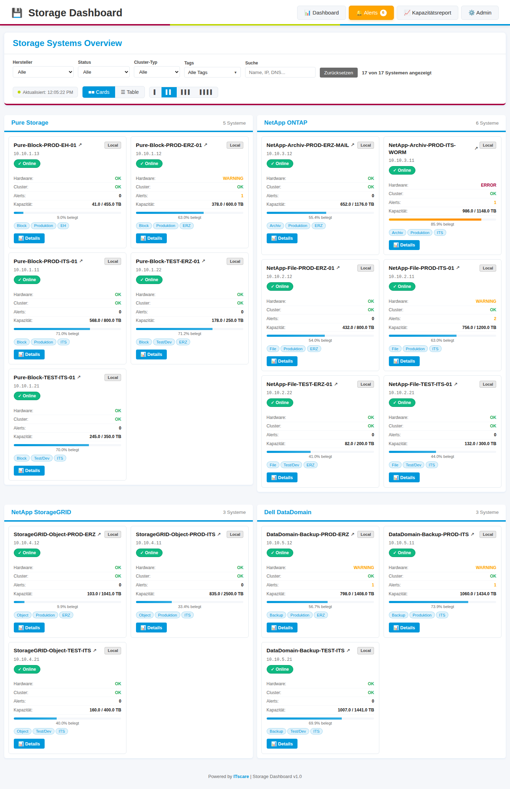
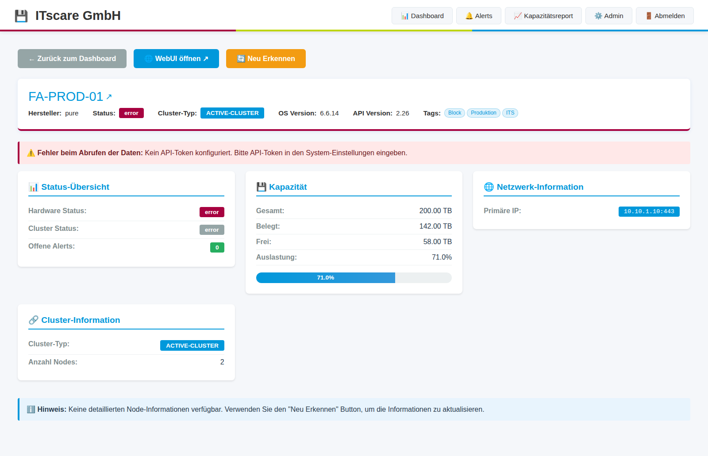
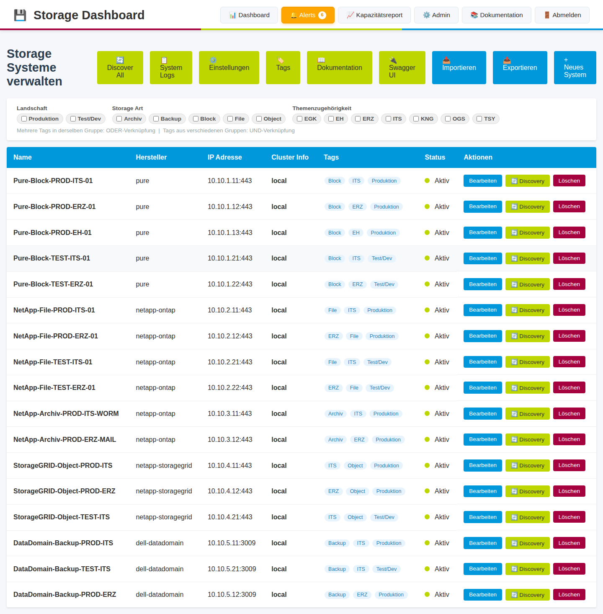
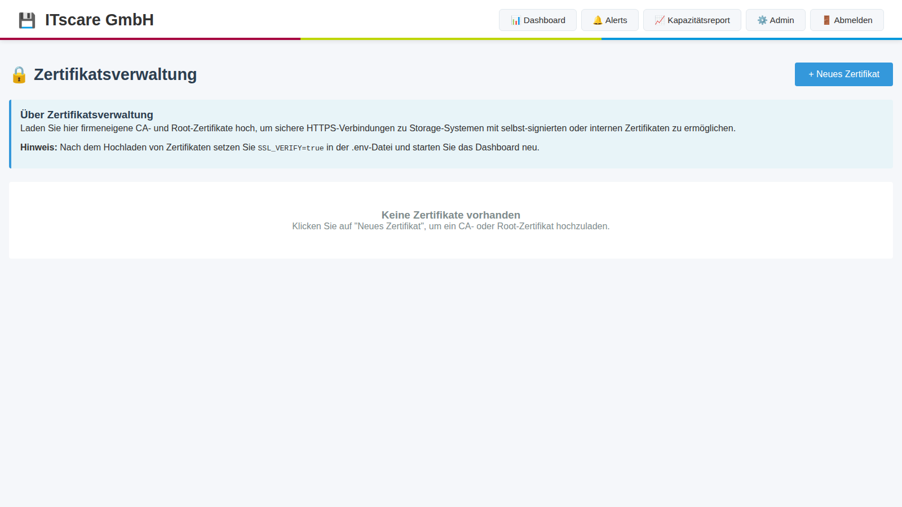

# Storage Dashboard

Ein Python-basiertes Dashboard zur Überwachung von Storage-Systemen verschiedener Hersteller über Browser und CLI.

## Screenshots

### Dashboard - Card View


### Dashboard - Details


### Admin-Bereich


> **Hinweis**: Das Dashboard verfügt über ein modernisiertes ITScare Design mit Auto-Refresh-Funktionalität.

## Features

- **Multi-Vendor Support**: Überwachung von Pure Storage, NetApp ONTAP 9, NetApp StorageGRID 11 und Dell DataDomain
- **Web Dashboard**: Übersichtliche Card/Grid-Ansicht aller Storage-Systeme
- **Auto-Refresh**: Automatische Aktualisierung des Dashboards alle 45 Sekunden (konfigurierbar)
- **Multithreading**: Parallele Abfrage aller Systeme für schnelle Performance
- **Modernes Design**: ITScare Corporate Design mit farbigen Accents und modernen UI-Elementen
- **CLI Interface**: Zugriff auf Dashboard-Daten über die Kommandozeile
- **Admin-Bereich**: Verwaltung von Storage-Systemen mit Namen, IPs und API-Credentials
- **API-Abfrage**: Automatische Abfrage von Health-Status über Hersteller-APIs
- **Status-Übersicht**: Hardware-Status, Cluster-Status, Alerts und Kapazität
- **Gruppierung**: Systeme nach Hersteller gruppiert
- **Single-Page-View**: Alle Systeme auf einen Blick ohne Scrollen
- **Filter-Funktionen**: Filterung nach Hersteller, Status, Cluster-Typ und Freitext-Suche

## Unterstützte Storage-Systeme

### Mit offiziellen Python-Bibliotheken:
- **Pure Storage Arrays** - Verwendet `py-pure-client` (offizielle Pure Storage SDK)
- **NetApp ONTAP 9** - Verwendet `netapp-ontap` (offizielle NetApp SDK)

### Mit REST API (requests):
- **NetApp StorageGRID 11** - REST API Integration
- **Dell DataDomain** - REST API v1.0 Integration

> **Hinweis:** Für StorageGRID und DataDomain sind keine offiziellen Python SDKs verfügbar. Das Dashboard verwendet direkte REST API Calls mit dem `requests` Modul.

## Systemanforderungen

- SUSE Linux 15 (oder andere Linux-Distribution)
- Python 3.8 oder höher
- Netzwerkzugriff zu den Storage-Systemen

## Installation

### Option 1: Container-Deployment (Empfohlen)

**Schnellstart mit vorgefertigtem GitHub Image:**

```bash
# .env Datei mit Secret Key erstellen
python3 -c "import secrets; print('SECRET_KEY=' + secrets.token_hex(32))" > .env
echo "SSL_VERIFY=false" >> .env

# Container mit vorgefertigtem Image starten
podman run -d \
  --name storage-dashboard \
  -p 5000:5000 \
  -v storage-data:/app/data:Z \
  --env-file .env \
  ghcr.io/timux/storage-dashboard:latest
```

**Oder mit Docker Compose (verwendet automatisch das GitHub Image):**

```bash
git clone https://github.com/TimUx/storage-dashboard.git
cd storage-dashboard

# Secret Key generieren und in .env speichern
python3 -c "import secrets; print('SECRET_KEY=' + secrets.token_hex(32))" > .env
echo "SSL_VERIFY=false" >> .env

# Mit Podman starten
podman-compose up -d

# Oder mit Docker starten
docker-compose up -d
```

Das Dashboard ist dann verfügbar unter: `http://localhost:5000`

📖 **Detaillierte Container-Dokumentation:** Siehe [CONTAINER.md](CONTAINER.md)

### Option 2: Manuelle Installation

#### 1. Repository klonen

```bash
git clone https://github.com/TimUx/storage-dashboard.git
cd storage-dashboard
```

#### 2. Python Virtual Environment erstellen

```bash
python3 -m venv venv
source venv/bin/activate  # Auf Linux/Mac
```

#### 3. Abhängigkeiten installieren

```bash
pip install -r requirements.txt
```

#### 4. Konfiguration

Kopieren Sie die Beispiel-Konfiguration:

```bash
cp .env.example .env
```

Optional: Passen Sie die `.env` Datei an (für Produktivumgebungen):

```
SECRET_KEY=your-secure-secret-key
DATABASE_URL=sqlite:///storage_dashboard.db
FLASK_ENV=production
```

## Verwendung

### Web-Dashboard starten

```bash
python run.py
```

Das Dashboard ist dann verfügbar unter: `http://localhost:5000`

**Dashboard-Features:**
- **Auto-Refresh**: Aktivieren Sie die Auto-Refresh-Funktion, um das Dashboard automatisch alle 45 Sekunden zu aktualisieren
- **Filter**: Nutzen Sie die Filteroptionen, um gezielt nach Systemen zu suchen
- **Ansichten**: Wechseln Sie zwischen Card-View (Kacheln) und Table-View (Tabelle)
- **Multithreading**: Alle Systeme werden parallel abgefragt für optimale Performance

Für Produktivumgebungen mit Gunicorn:

```bash
gunicorn -w 4 -b 0.0.0.0:5000 run:app
```

### CLI verwenden

**Dashboard anzeigen:**

```bash
python cli.py dashboard
```

**Systeme verwalten:**

```bash
# Alle Systeme auflisten
python cli.py admin list

# Neues System hinzufügen
python cli.py admin add

# System aktivieren/deaktivieren
python cli.py admin enable <ID>
python cli.py admin disable <ID>

# System löschen
python cli.py admin remove <ID>
```

## Web-Interface

### Dashboard (`/`)

Zeigt alle aktivierten Storage-Systeme gruppiert nach Hersteller:
- **Auto-Refresh**: Optionale automatische Aktualisierung alle 45 Sekunden mit Countdown-Timer
- **Ansichten**: Umschaltbar zwischen Card-View (Kacheln) und Table-View (Tabelle)
- **Filter**: Filterung nach Hersteller, Status, Cluster-Typ und Freitext-Suche (Name, IP, DNS)
- Hardware-Status
- Cluster-Status
- Anzahl Alerts
- Kapazität (gesamt, belegt, Prozent)
- Visuelle Kapazitäts-Anzeige mit Farbcodierung
- Direkte Links zur System-WebUI
- ITScare Corporate Design mit modernen Farbakzenten

### Admin-Bereich (`/admin`)

- Übersicht aller konfigurierten Systeme
- Systeme hinzufügen, bearbeiten, löschen
- Aktivieren/Deaktivieren von Systemen
- Zertifikatsverwaltung für firmeneigene CA- und Root-Zertifikate

📖 **Detailliertes Administrator-Handbuch:** Siehe [ADMIN_GUIDE.md](ADMIN_GUIDE.md)

### Zertifikatsverwaltung (`/admin/certificates`)



Das Dashboard unterstützt firmeneigene CA- und Root-Zertifikate für sichere Verbindungen in internen Netzwerken:

- **CA-Zertifikate hochladen**: Intermediate oder Sub-CA Zertifikate
- **Root-Zertifikate verwalten**: Oberste Zertifizierungsstelle
- **PEM-Format**: Unterstützung für .pem, .crt, .cer Dateien
- **Aktivieren/Deaktivieren**: Flexible Kontrolle über verwendete Zertifikate
- **Download**: Exportieren Sie gespeicherte Zertifikate

**Verwendung:**
1. Navigieren Sie zu `/admin/certificates`
2. Laden Sie Ihre firmeneigenen Zertifikate hoch
3. Setzen Sie `SSL_VERIFY=true` in der `.env`-Datei
4. Starten Sie das Dashboard neu

## Container-Deployment

Das Dashboard kann als Docker/Podman Container betrieben werden. Siehe [CONTAINER.md](CONTAINER.md) für Details.

**Schnellstart mit vorgefertigtem GitHub Image:**
```bash
# .env Datei mit Secret Key erstellen
python3 -c "import secrets; print('SECRET_KEY=' + secrets.token_hex(32))" > .env
echo "SSL_VERIFY=false" >> .env

# Container starten
podman run -d \
  --name storage-dashboard \
  -p 5000:5000 \
  -v storage-data:/app/data:Z \
  --env-file .env \
  ghcr.io/timux/storage-dashboard:latest
```

Dashboard verfügbar unter: `http://localhost:5000`

**Mit Docker Compose:**
```bash
git clone https://github.com/TimUx/storage-dashboard.git
cd storage-dashboard

# .env Datei mit Secret Key erstellen
python3 -c "import secrets; print('SECRET_KEY=' + secrets.token_hex(32))" > .env
echo "SSL_VERIFY=false" >> .env

# Container starten (verwendet automatisch das GitHub Image)
podman-compose up -d
```

### Dokumentation (`/admin/docs`)

Detaillierte Anleitungen zur API-Einrichtung für jedes Storage-System.

## API-Einrichtung

### Pure Storage

1. Im FlashArray unter **System → Users** einen API-Token erstellen
2. Token im Dashboard unter "API Token" eintragen

### NetApp ONTAP 9

1. Benutzer mit REST API-Zugriff erstellen
2. Benutzername und Passwort im Dashboard eintragen

### NetApp StorageGRID 11

1. Im Management Interface API-Credentials erstellen
2. Bearer Token generieren und im Dashboard eintragen

### Dell DataDomain

1. REST API aktivieren
2. Benutzer mit entsprechenden Rechten erstellen
3. Benutzername und Passwort im Dashboard eintragen

Detaillierte Anleitungen finden Sie in der Web-Dokumentation unter `/admin/docs`.

## REST API Endpoints

Das Dashboard bietet auch programmatischen Zugriff:

- `GET /api/systems` - Liste aller Systeme
- `GET /api/status` - Status aller aktivierten Systeme
- `GET /api/systems/<id>/status` - Status eines spezifischen Systems

## Entwicklung

### Projektstruktur

```
storage-dashboard/
├── app/
│   ├── __init__.py          # Flask App Factory
│   ├── models.py            # Datenbankmodelle
│   ├── api/                 # Storage API Clients
│   │   ├── base_client.py
│   │   └── storage_clients.py
│   ├── routes/              # Flask Routes
│   │   ├── main.py          # Dashboard
│   │   ├── admin.py         # Admin-Bereich
│   │   └── api.py           # REST API
│   └── templates/           # HTML Templates
│       ├── base.html
│       ├── dashboard.html
│       └── admin/
├── run.py                   # Web-Server Startskript
├── cli.py                   # CLI Interface
├── requirements.txt         # Python-Abhängigkeiten
└── README.md
```

### Neue Storage-Systeme hinzufügen

Um ein neues Storage-System zu unterstützen:

1. Erstellen Sie eine neue Client-Klasse in `app/api/storage_clients.py`
2. Implementieren Sie die `get_health_status()` Methode
3. Registrieren Sie den Client in der `get_client()` Factory-Funktion
4. Fügen Sie die Vendor-Option in den Admin-Formularen hinzu

## Sicherheit

**Interne Netzwerk-Anwendung:**
- Das Dashboard ist ausschließlich für den Einsatz in internen Firmennetzwerken konzipiert
- Verwendet firmeneigene CA- und Root-Zertifikate (keine Let's Encrypt oder öffentliche CAs)
- Zertifikatsverwaltung im Admin-Bereich verfügbar

**Sicherheitsfeatures:**
- API-Credentials werden in der Datenbank gespeichert
- HTTPS-Verbindungen zu Storage-Systemen mit Custom CA-Zertifikaten
- Verwenden Sie dedizierte Read-Only-Accounts für Storage-Systeme
- Ändern Sie den `SECRET_KEY` in Produktivumgebungen
- Setzen Sie `SSL_VERIFY=true` in `.env` und laden Sie CA-Zertifikate im Admin-Bereich hoch

**Hinweis zur Passwort-Speicherung**: In der aktuellen Version werden Passwörter im Klartext in der Datenbank gespeichert. Für produktive Umgebungen sollte eine Verschlüsselung implementiert werden (z.B. mit `cryptography.fernet`).

## Lizenz

Siehe LICENSE Datei.

## Support

Bei Fragen oder Problemen erstellen Sie bitte ein Issue im GitHub Repository.