# Storage Dashboard

Ein Python/Flask-basiertes Dashboard zur Überwachung von Storage-Systemen verschiedener Hersteller über Browser und CLI.

---

## Inhaltsverzeichnis

1. [Übersicht & Features](#1-übersicht--features)
2. [Unterstützte Storage-Systeme](#2-unterstützte-storage-systeme)
3. [Dashboard-Ansicht](#3-dashboard-ansicht)
4. [Alerts-Seite](#4-alerts-seite)
5. [System-Detailansicht](#5-system-detailansicht)
6. [Kapazitätsreport](#6-kapazitätsreport)
7. [Admin-Bereich](#7-admin-bereich)
8. [Einstellungen](#8-einstellungen)
9. [API & Swagger UI](#9-api--swagger-ui)
10. [Systemanforderungen](#10-systemanforderungen)
11. [Installation](#11-installation)
12. [Admin-Benutzer erstellen](#12-admin-benutzer-erstellen)
13. [CLI-Interface](#13-cli-interface)
14. [Deployment](#14-deployment)

---

## 1. Übersicht & Features

Storage Dashboard überwacht Pure Storage, NetApp ONTAP, NetApp StorageGRID und Dell DataDomain zentral über deren REST APIs – ohne herstellerspezifische SDKs.

**Kernfunktionen:**

| Funktion | Beschreibung |
|----------|-------------|
| **Multi-Vendor Support** | Pure Storage, NetApp ONTAP 9, NetApp StorageGRID 11, Dell DataDomain |
| **Echtzeit-Dashboard** | Card- und Table-Ansicht aller Systeme mit farbkodierten Status-Badges |
| **Alerts-Seite** | Konsolidierte Übersicht aller offenen Alerts aller Systeme inkl. ONTAP EMS Events |
| **Kapazitätsreport** | Tabellarische und grafische Kapazitätsübersicht (5 Ansichten) mit 2-Jahres-Verlauf |
| **System-Detailansicht** | Einzelsystem-Daten mit Capacity, Hardware-Status, Node-Infos und Alerts |
| **Hintergrund-Polling** | Konfigurierbarer Hintergrunddienst (1–60 min) mit UI-seitigem Caching |
| **Auto-Refresh** | Automatische Dashboard-Aktualisierung ohne Seiten-Reload |
| **Pure1 Integration** | Storage on Demand (SoD) Daten mit Verlauf und Effektivwerten |
| **Proxy-Unterstützung** | HTTP/HTTPS-Proxy für ausgehende Verbindungen (z.B. Pure1) |
| **CLI Interface** | Lokal und Remote (HTTP API) |
| **REST API + Swagger UI** | Vollständig dokumentierte API mit interaktiver Swagger-Oberfläche |
| **SSL-Zertifikatsverwaltung** | Upload eigener CA/Root-Zertifikate für interne Storage-Systeme |
| **Tag-System** | Flexibles Tagging (Storage Art, Landschaft, Tätigkeitsfeld) |
| **Admin-Bereich** | Systemverwaltung, Einstellungen, Logs, Zertifikate |

---

## 2. Unterstützte Storage-Systeme

Alle Systeme werden über standardmäßige REST API Calls angebunden:

| System | API | Authentifizierung |
|--------|-----|-------------------|
| **Pure Storage FlashArray** | REST API v2 | API Token |
| **NetApp ONTAP 9** | ONTAP REST API | Benutzername / Passwort |
| **NetApp StorageGRID 11** | Grid Management API v4 | Benutzername / Passwort |
| **Dell DataDomain** | DataDomain REST API v1.0 | Benutzername / Passwort |

> **Hinweis:** Das Dashboard liest für NetApp ONTAP automatisch EMS-Events (Emergency/Alert/Error) aus dem Event Management System aus – vollständig via REST API, ohne SNMP oder proprietäre Agenten.

---

## 3. Dashboard-Ansicht

Das Haupt-Dashboard zeigt alle Storage-Systeme gruppiert nach Hersteller in zwei wählbaren Ansichten.

### Card-Ansicht – Light & Dark Mode

Das Dashboard unterstützt einen hellen (Standard) und einen dunklen Modus, umschaltbar über den 🌙/☀️-Button in der Navbar.

**Light Mode (Standard):**


**Dark Mode:**

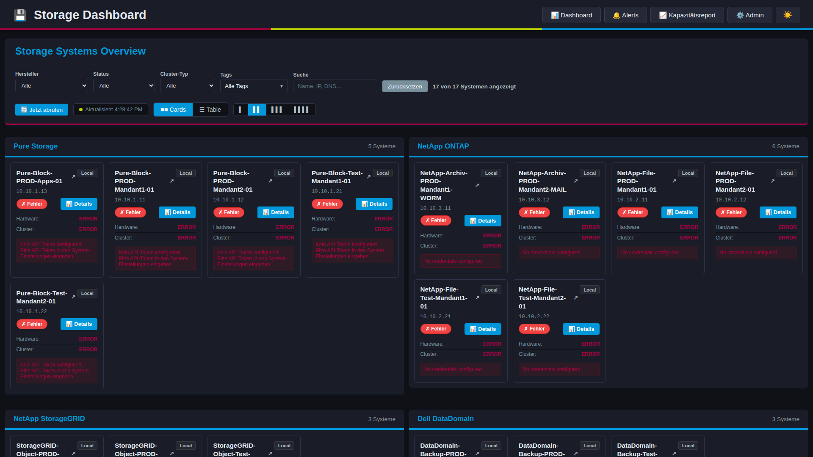

### Table-Ansicht

Kompakte Tabellenansicht aller Systeme mit denselben Statusinformationen – ideal bei vielen Systemen.

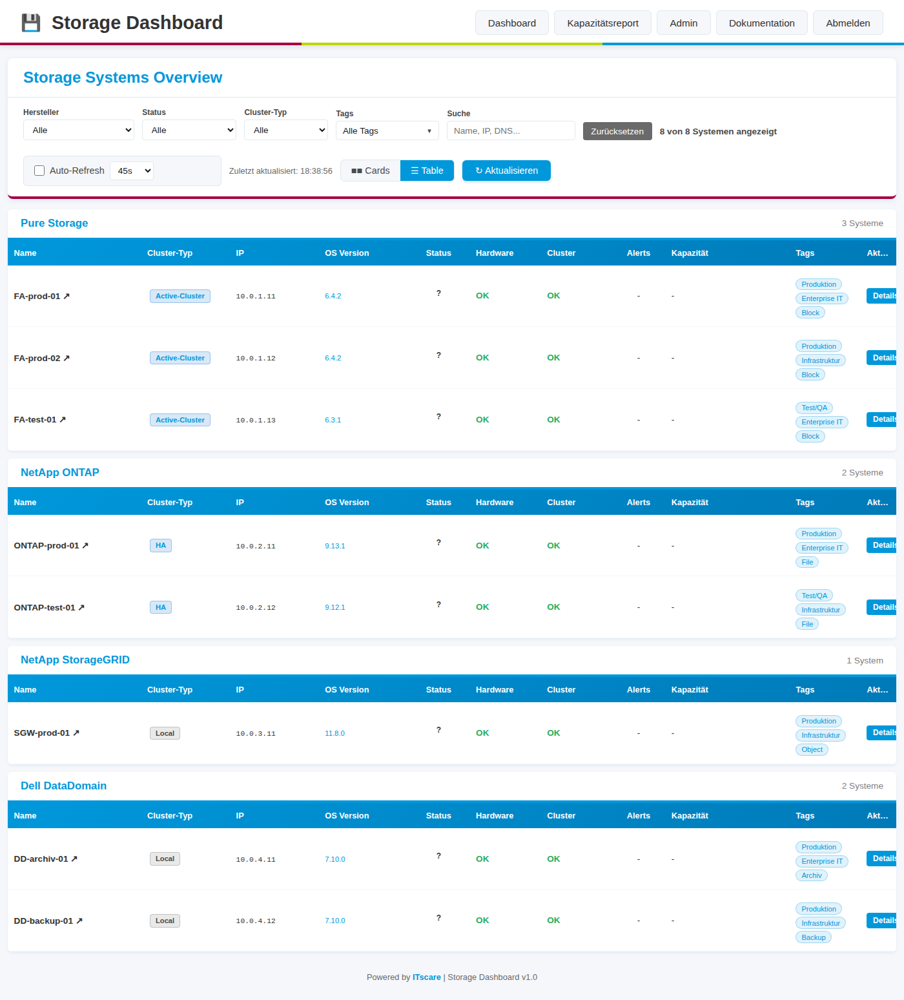

**Dashboard-Features:**
- **Filter**: Hersteller, Status, Cluster-Typ, Tags, Freitext
- **🔔 Alerts-Badge**: Navbar-Button zeigt Anzahl offener Alerts aller Systeme
- **↻ Aktualisieren**: Sofortige manuelle Datenaktualisierung per Button
- **Auto-Refresh**: 30–120 Sekunden (konfigurierbar), ohne Seiten-Reload
- **Spaltenbreite**: 1–4 Spalten umschaltbar (Card-Ansicht)
- **Hintergrund-Caching**: Status-Daten werden im Hintergrund gecacht – die UI erscheint sofort

---

## 4. Alerts-Seite

Die Alerts-Seite aggregiert alle offenen Alerts aus dem Status-Cache aller Systeme in einer zentralen Tabelle. Sie ist über den orangen 🔔-Button in der Navbar erreichbar (zeigt Anzahl offener Alerts).

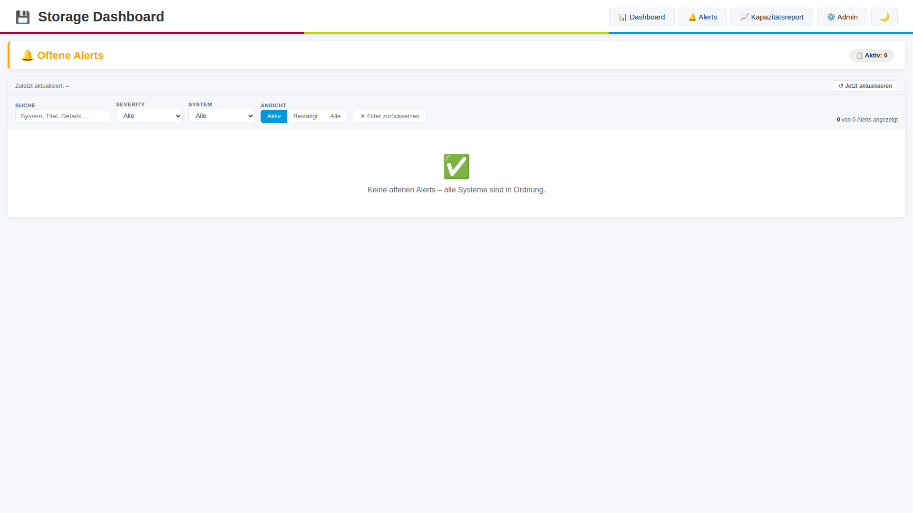

**Unterstützte Alert-Quellen:**

| Hersteller | Alert-Quelle | Felder |
|-----------|-------------|--------|
| **NetApp ONTAP** | EMS Events (`/api/support/ems/events`) | Severity (Emergency/Alert/Error), EMS-Name, Log-Message, Node, Zeitstempel |
| **Pure Storage** | Array Alerts | Severity, Titel, Details, Error-Code, Komponente |
| **NetApp StorageGRID** | Grid Alerts | Severity, Alert-Name, Details, Node |
| **Dell DataDomain** | Active Alerts | Severity, Alert-Name, Kategorie, Meldung |

**ONTAP EMS Alert-Abfrage:**  
Das Dashboard ruft via `GET /api/support/ems/events?message.severity=emergency,alert,error` die letzten 100 EMS Events ab. Die Severity wird auf den Hardware-Status gemappt:
- `emergency` → `hardware_status = error`
- `alert` / `error` → `hardware_status = warning`

---

## 5. System-Detailansicht

Erreichbar über den **Details**-Button einer Systemkarte oder direkt via `/systems/<id>/details`.


**Angezeigte Informationen:**
- Hersteller, Live-Status (oder letzter Caching-Zustand mit Hinweis-Banner)
- Hardware-Status, Cluster-Status, Alerts-Zähler
- Kapazität (Gesamt/Genutzt/Frei/Auslastung) – mit Pure1-Korrekturwerten wenn verfügbar
- Netzwerk-Information (IP, Ports)
- Cluster-Informationen (Typ, Partner)
- Node-Details, Hardware-Komponenten (wenn verfügbar)

> **Caching-Fallback**: Wenn die Live-Abfrage fehlschlägt (z.B. kein Netz), werden automatisch die zuletzt gecachten Status-Daten angezeigt – mit gelbem Hinweis-Banner.

---

## 6. Kapazitätsreport

Der Kapazitätsreport ist unter `/capacity/` erreichbar und bietet fünf Tabs.

### Tab: Nach Storage Art

Kapazitäten gruppiert nach Storage-Typ (Block → File → Object → Archiv → Backup), jeweils mit Untergruppierung nach Umgebung.


### Tab: Nach Umgebung

Kapazitäten gruppiert nach Betriebsumgebung (Produktion / Test/Dev), jeweils mit Untergruppierung nach Storage Art.


### Tab: Nach Tätigkeitsfeld

Kapazitäten gruppiert nach Themenzugehörigkeit (Mandant-1, Mandant-2, Apps, …), jeweils mit Aufschlüsselung nach Umgebung und Storage Art.


### Tab: Details

Alle Einzelsysteme mit Umgebung, Tätigkeitsfeld, Gesamt/Genutzt/Frei und Auslastungs-Balken.


### Tab: Verlauf

Historische Kapazitätsgraphen (2 Jahre tägliche Datenpunkte) für alle Storage-Typen:
- **Block**: Physische Kapazität + SoD-Vertragswerte parallel (mit Linienfilter)
- **File / Object / Archiv / Backup**: Genutzte Kapazität je System


**Verlauf-Steuerleiste** (Zeitraum, Export, Import):

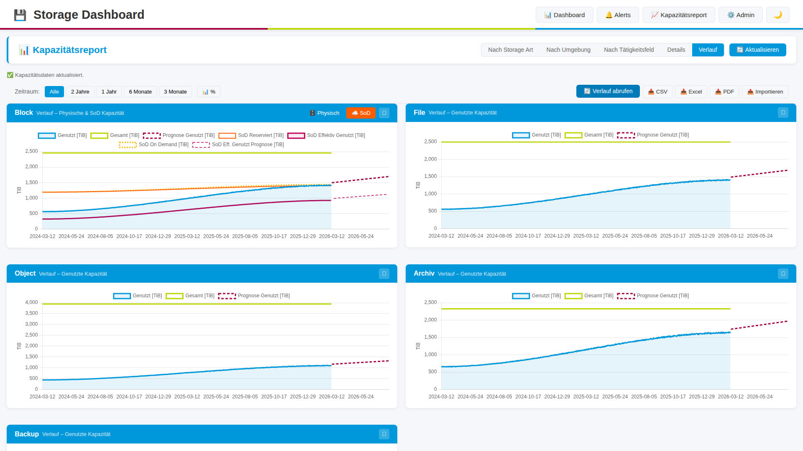

**Weitere Kapazitäts-Features:**
- Zeitraum-Filter: Alle / 2 Jahre / 1 Jahr / 6 Monate / 3 Monate
- Export: CSV, Excel, PDF
- Import: CSV-Upload für physische Systeme und SoD-Daten
- Prognose: Wachstumsprognose im Verlaufsgraphen
- Pure1 SoD-Tab: Nur sichtbar wenn Pure1 in Einstellungen konfiguriert

---

## 7. Admin-Bereich

Der Admin-Bereich (`/admin`) ist durch Login geschützt und enthält Systemverwaltung, Einstellungen, Logs, Zertifikate und Tags.


**Hauptfunktionen:**
- Storage-Systeme hinzufügen, bearbeiten, löschen
- Systeme aktivieren/deaktivieren
- Auto-Discovery (Erkennung von Cluster-Topologien, IPs, Node-Details)
- Import/Export von Systemkonfigurationen
- Logs-Viewer mit Filter- und Such-Funktionen
- Zertifikatsverwaltung
- Tag-Verwaltung

### Logs-Viewer

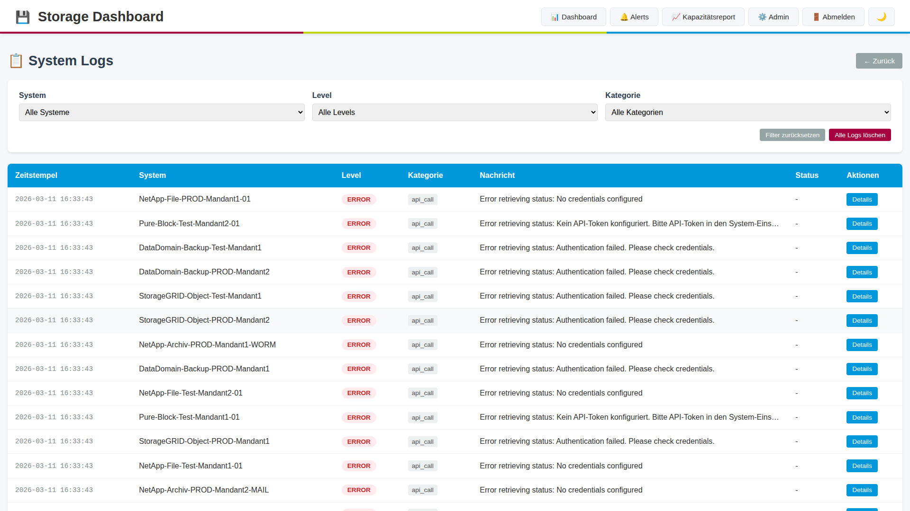

### Zertifikatsverwaltung

Upload eigener CA- und Root-Zertifikate für Storage-Systeme mit selbst-signierten Zertifikaten.


### Tag-Verwaltung

Tags können in Gruppen organisiert werden (z.B. „Storage Art", „Landschaft", „Themenzugehörigkeit") und werden für Filterung und Kapazitätsgrupierung verwendet.

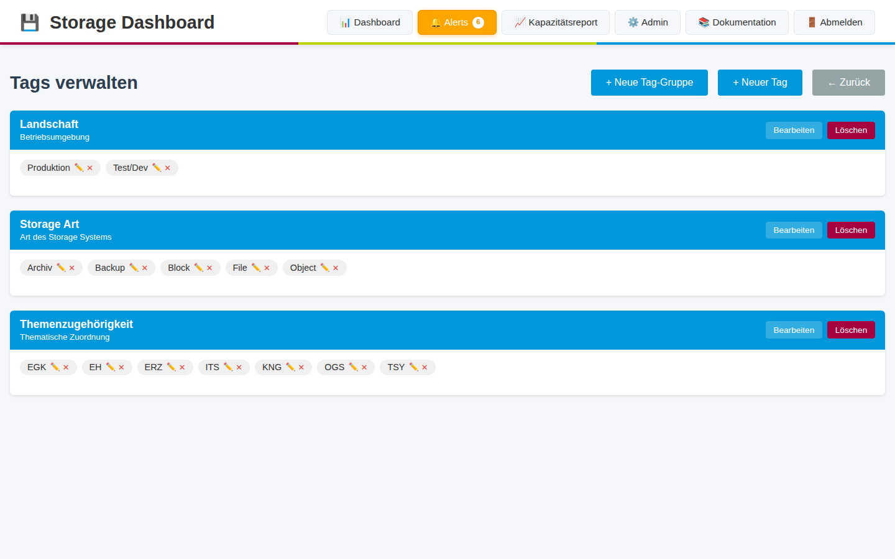

---

## 8. Einstellungen

Erreichbar unter **Admin → Einstellungen** (`/admin/settings`). Die Einstellungen sind in sechs Tabs unterteilt.

### Tab: Design

Firmenname, Logo und Farbschema (Primär-, Sekundär- und Akzentfarbe).

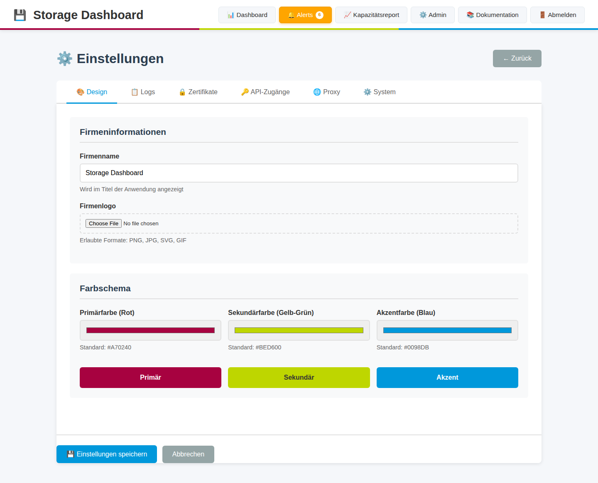

### Tab: Logs

Maximale Anzahl Logs pro System, Aufbewahrungsdauer und minimales Log-Level.

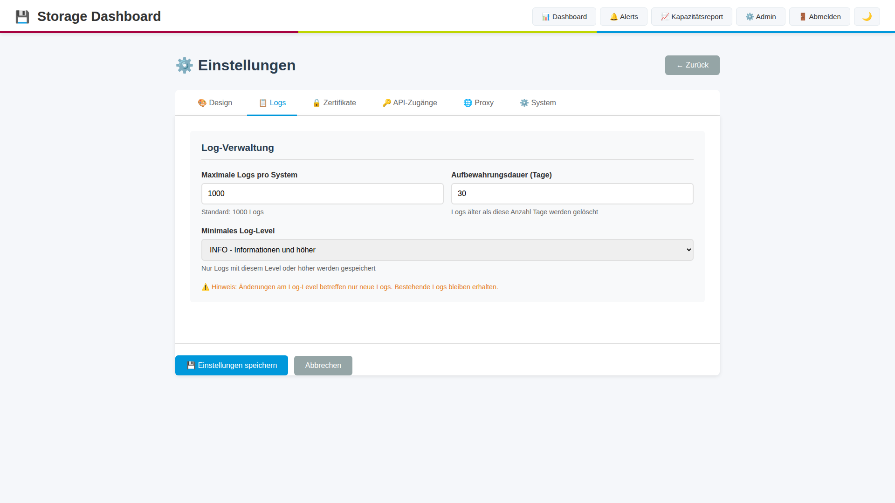

### Tab: Zertifikate

Upload eigener CA- und Root-Zertifikate für Storage-Systeme mit selbst-signierten Zertifikaten.

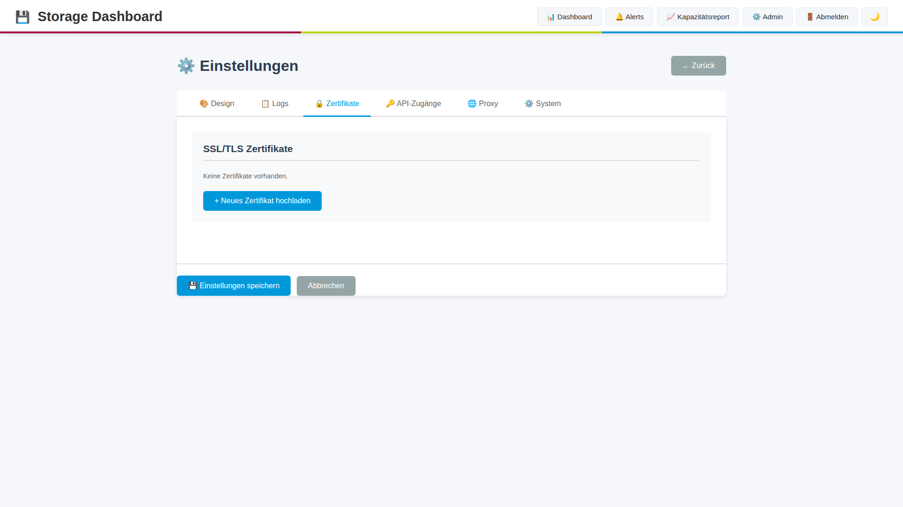

### Tab: API-Zugänge (Pure1)

Konfiguration der Pure1 REST API für Storage on Demand Daten. App-ID, Private Key (PEM), Passphrase und Public Key werden **verschlüsselt** gespeichert.


### Tab: Proxy

HTTP/HTTPS-Proxy für ausgehende Internet-Verbindungen (z.B. für Pure1). Proxy-URLs werden **verschlüsselt** gespeichert.


### Tab: System

Zeitzone und Hintergrund-Aktualisierungsintervall (1–60 Minuten).

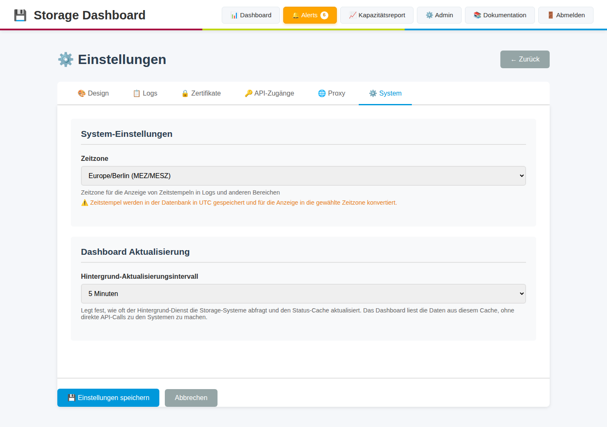

---

## 9. API & Swagger UI

Das Dashboard stellt eine vollständige REST API bereit. Die interaktive Swagger UI ist unter `/admin/swagger` erreichbar.

### Swagger UI

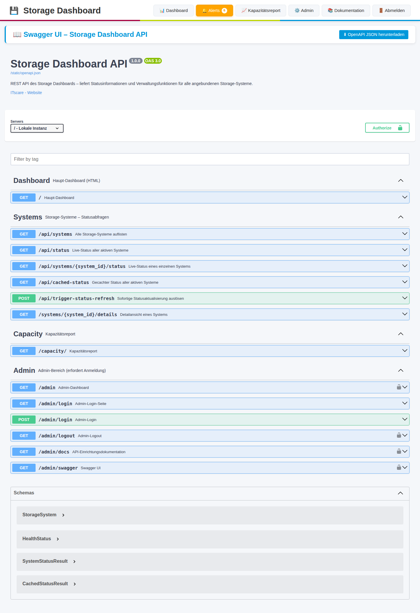

Die API umfasst folgende Endpunkte:

| Methode | Pfad | Beschreibung |
|---------|------|-------------|
| `GET` | `/` | Haupt-Dashboard (HTML) |
| `GET` | `/api/systems` | Alle Storage-Systeme auflisten |
| `GET` | `/api/status` | Live-Status aller aktiven Systeme |
| `GET` | `/api/systems/{id}/status` | Live-Status eines einzelnen Systems |
| `GET` | `/api/cached-status` | Gecachter Status aller aktiven Systeme |
| `POST` | `/api/trigger-status-refresh` | Sofortige Statusaktualisierung auslösen |
| `GET` | `/systems/{id}/details` | Detailansicht eines Systems |
| `GET` | `/capacity/` | Kapazitätsreport |
| `GET` | `/alerts/` | Alerts-Seite |
| `GET` | `/admin/*` | Admin-Bereich (erfordert Anmeldung) |

### API-Dokumentation (Einrichtungsanleitung)

Unter `/admin/docs` finden Sie eine detaillierte Einrichtungsanleitung für jeden unterstützten Hersteller.

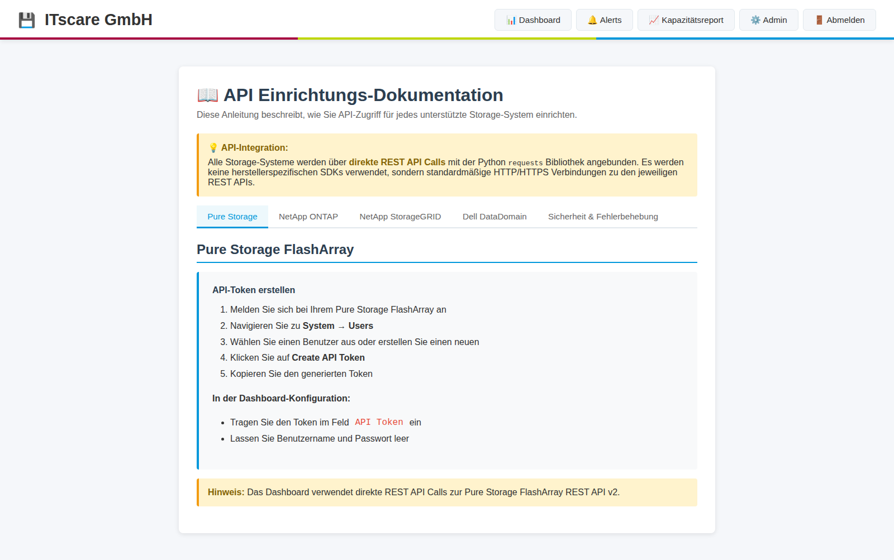

**OpenAPI-Spezifikation** herunterladen: `/static/openapi.json`

---

## 10. Systemanforderungen

- **Betriebssystem**: Linux (SUSE 15, Ubuntu 22+, RHEL 8+, oder vergleichbar)
- **Python**: 3.8 oder höher
- **Datenbank**: PostgreSQL (empfohlen) oder SQLite
- **Netzwerk**: HTTPS-Zugriff zu den Storage-Systemen (Port 443)

> **Empfehlung**: PostgreSQL für Produktivumgebungen – SQLite kann bei vielen parallelen Zugriffen zu Sperrkonflikten führen. Für Container-Deployments wird PostgreSQL automatisch über `docker-compose.yml` mitgestartet.

---

## 11. Installation

### Option 1: Container-Deployment (Empfohlen)

```bash
git clone https://github.com/TimUx/storage-dashboard.git
cd storage-dashboard

# Secret Keys generieren und in .env speichern
python3 -c "import secrets; print('SECRET_KEY=' + secrets.token_hex(32))" > .env
python3 -c "import secrets; print('POSTGRES_PASSWORD=' + secrets.token_hex(32))" >> .env
echo "SSL_VERIFY=false" >> .env

# Mit Podman starten
podman-compose up -d

# Oder mit Docker
docker-compose up -d

# Oder mit nerdctl
nerdctl compose up -d
```

Das Dashboard ist dann verfügbar unter: `http://localhost:5000`

📖 **Container-Dokumentation**: [CONTAINER.md](CONTAINER.md)

### Option 2: Manuelle Installation

```bash
# 1. Repository klonen
git clone https://github.com/TimUx/storage-dashboard.git
cd storage-dashboard

# 2. Virtual Environment erstellen
python3 -m venv venv
source venv/bin/activate

# 3. Abhängigkeiten installieren
pip install -r requirements.txt

# 4. Konfiguration anpassen
cp .env.example .env
# .env bearbeiten: SECRET_KEY, DATABASE_URL, SSL_VERIFY

# 5. Datenbank initialisieren und migrieren
python cli.py migrate

# 6. Server starten
python run.py
```

---

## 12. Admin-Benutzer erstellen

Vor der ersten Nutzung muss ein Admin-Benutzer angelegt werden:

### Manuelle Installation

```bash
python cli.py admin create-user
```

### Container (Docker/Podman/nerdctl)

```bash
# Docker
docker exec -it storage-dashboard python cli.py admin create-user

# Podman
podman exec -it storage-dashboard python cli.py admin create-user

# nerdctl
nerdctl exec -it storage-dashboard python cli.py admin create-user
```

Der Admin-Bereich ist dann unter `http://localhost:5000/admin` erreichbar.

---

## 13. CLI-Interface

### Lokale CLI (`cli.py`)

```bash
# Dashboard anzeigen
python cli.py dashboard

# Systeme verwalten
python cli.py admin list
python cli.py admin add
python cli.py admin enable <ID>
python cli.py admin disable <ID>
python cli.py admin remove <ID>

# Datenbank migrieren
python cli.py migrate
```

### Remote CLI (`remote-cli.py`)

```bash
# Dashboard (Standard: http://localhost:5000)
python remote-cli.py dashboard

# Remote-System
python remote-cli.py --url http://dashboard.example.com:5000 dashboard

# Alle Systeme auflisten
python remote-cli.py systems

# Status eines Systems
python remote-cli.py status <ID>

# Daten exportieren
python remote-cli.py export --format json
python remote-cli.py export --format table
```

📖 **Remote-CLI-Dokumentation**: [REMOTE_CLI.md](REMOTE_CLI.md)

---

## 14. Deployment

### Produktivumgebung mit Gunicorn

```bash
gunicorn -w 4 -b 0.0.0.0:5000 run:app
```

### systemd-Service

```bash
sudo cp storage-dashboard.service /etc/systemd/system/
sudo systemctl daemon-reload
sudo systemctl enable storage-dashboard
sudo systemctl start storage-dashboard
```

### Datenbankmigrationen

Das Dashboard verfügt über ein eingebautes Migrationssystem (`app/migrations.py`), das bei jedem Start automatisch ausgeführt wird und fehlende Spalten ergänzt. Bei Bedarf kann die Migration auch manuell ausgeführt werden:

```bash
python cli.py migrate
```

### Umgebungsvariablen

| Variable | Beschreibung | Standard |
|----------|-------------|---------|
| `SECRET_KEY` | Flask Session-Secret (zufälliger Hex-String) | — (Pflichtfeld) |
| `DATABASE_URL` | Datenbankverbindung | `sqlite:///storage_dashboard.db` |
| `SSL_VERIFY` | TLS-Zertifikate prüfen | `true` |
| `FLASK_ENV` | `development` oder `production` | `production` |
| `POSTGRES_PASSWORD` | PostgreSQL-Passwort (nur Container) | — |

📖 **Deployment-Dokumentation**: [DEPLOYMENT.md](DEPLOYMENT.md)  
📖 **Sicherheits-Dokumentation**: [SECURITY.md](SECURITY.md)  
📖 **Container-Dokumentation**: [CONTAINER.md](CONTAINER.md)  
📖 **Administrator-Handbuch**: [ADMIN_GUIDE.md](ADMIN_GUIDE.md)  
📖 **Developer Guide**: [DEVELOPER_GUIDE.md](DEVELOPER_GUIDE.md)

---

*Storage Dashboard v1.0 – Created by [Timo Braun](mailto:github@timobraun.de)*
